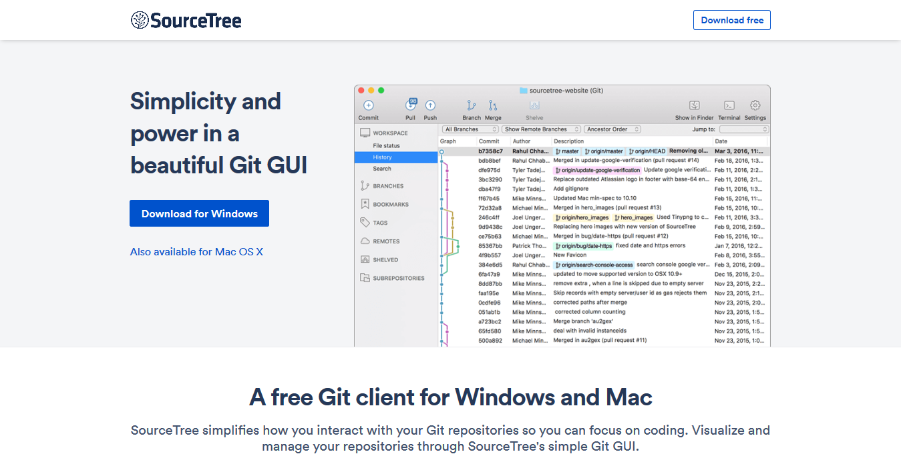
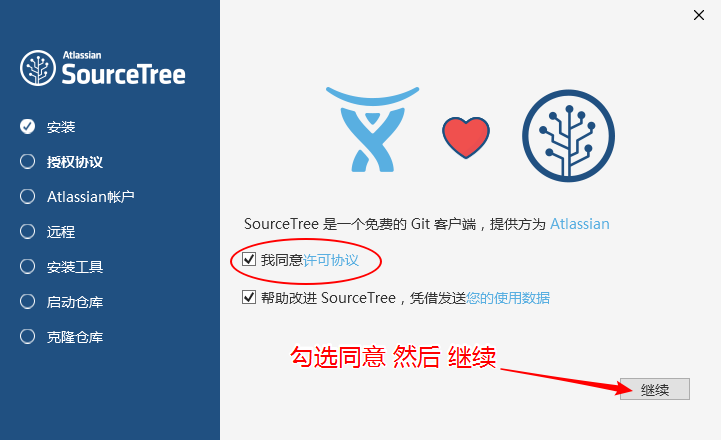
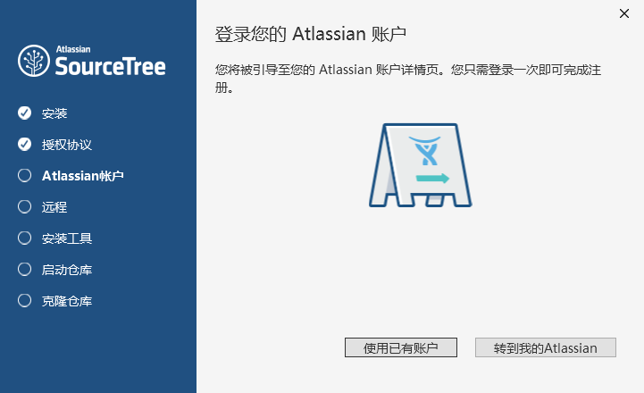
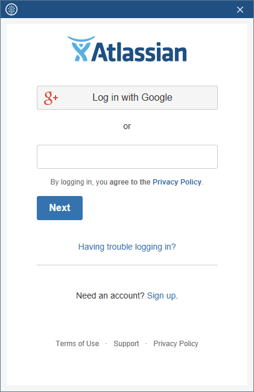
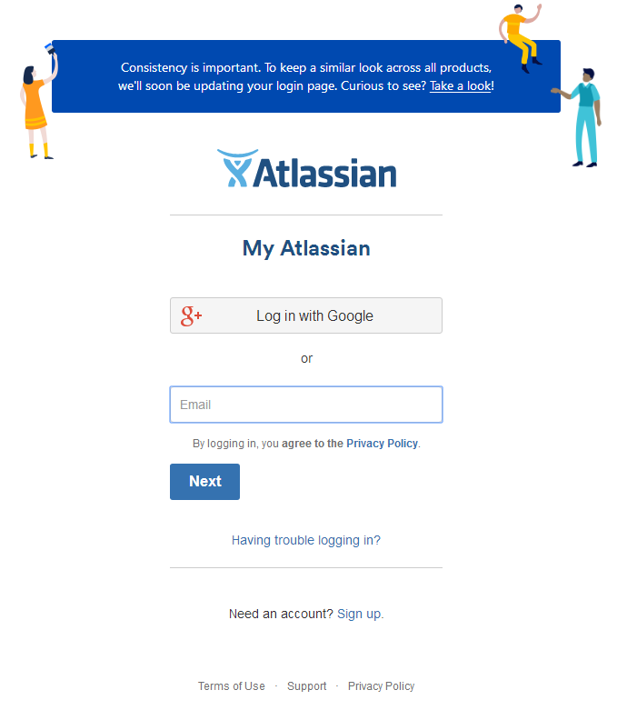
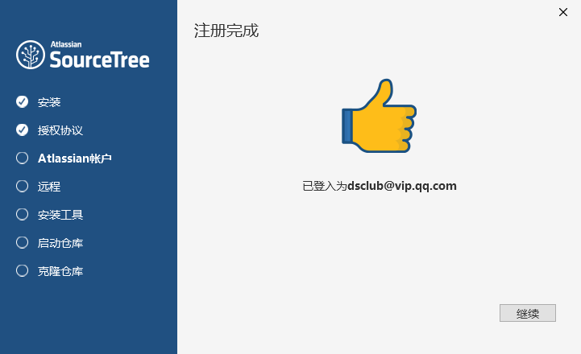
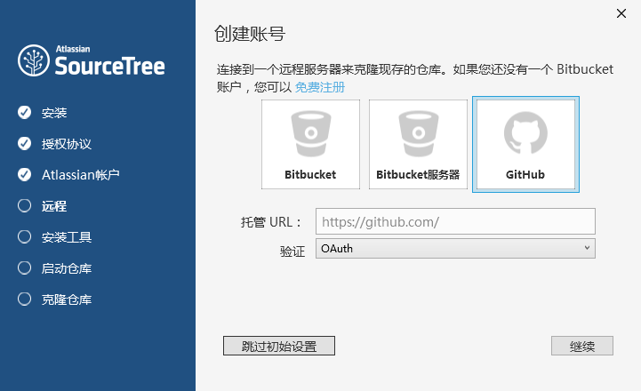
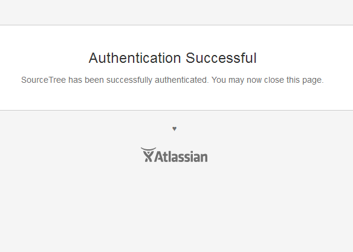
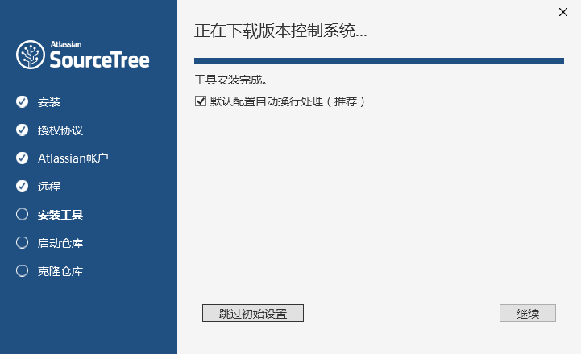
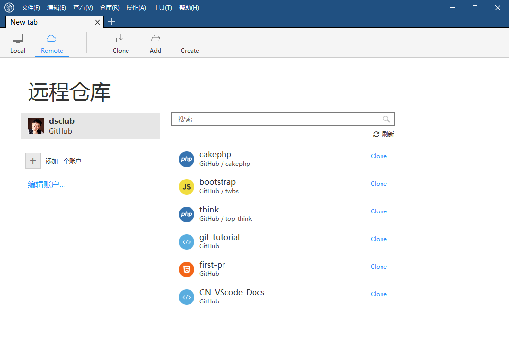

# 安装Source Tree

Source Tree是一款免费的软件，提供Windows和Mac的安装版本。

## 下载

官方网址是：https://www.sourcetreeapp.com/

英文网站，内容组织清晰的界面让你很轻松就能找到对应的下载版本。

## 安装

安装过程是很常规的方式，自己可以找到很多对应的基础教程。为了方便还是列出一些安装过程的截图。

1. 运行安装程序。
2. 点击“继续”按钮后，启用授权协议。遗憾的是这个步骤不能跳过，如果已经有了Atlassian账户请选择“使用已有账户”否则需要免费申请一个新的账户，点击“转到我的Atlassian”可以进入注册流程。 
    - 使用已有账户打开的弹窗。
        - 输入已有账户的用户名和密码，然后点击“Log in”即可。
    - 转到我的Atlassian对应的网页。
3. 授权成功的提示。
4. 选择后面可以克隆的远程账户，这个步骤可以跳过以后再完成。不希望跳过的用户可以在这里设置好已经存在的Bitbucket或GitHub账户。我这里使用了自己的GitHub账户。
    - 在弹出网页上启用对应授权后，得到成功的提示即可。
5. 设置好远程账户（或跳过上一步骤）就是自动安装工具了，只需要静静等待即可。
6. 最后安装好就会启动软件啦，之前设置过远程账户的可以选择同步自己的远程仓库了。

以上就是一般的安装步骤。

小茗在得知Source Tree这款神器后，当晚就试着安装了。不过还是发现了一些问题。我们来把小茗遇到的问题，给大家（主要是身在国内的同志们）总结一下，安装过程中有两个要点需要注意：

1. 安装过程的第二步，需要使用[Atlassian](https://www.atlassian.com/)网站的[My Atlassian账户](https://id.atlassian.com)，这是必须的。或者可以使用Google的账户授权登录。没有账户的可以免费注册申请。
2. 有时会出现Google的CAPTCHA进行验证。

之所以提到这两点是因为，国内的互联网是无法正常链接到上述两个网站的（Atlassian偶尔能打开，但是速度极慢；Google估计长期时间内是无法打开的了）。所以，如果查阅网上的资料都会提到*翻墙*才能安装的问题。有关翻墙的话题不属于咱们要讨论的，在公开的教程中应该也不能提及翻墙的内容。总之，就是想办法连上网站。这些方法，有付费的，有免费的。考虑到如果你是职场人士，目前很多公司（尤其有涉外业务的）都会提供VPN服务，所以这应该不是太大问题。

不过，一些爱做技术探究的人士还是给出了在无法提供账户登录的情况下继续安装Source Tree的办法——[Source Tree 免登录跳过初始设置](http://www.cnblogs.com/xiofee/p/sourcetree_pass_initialization_setup.html)。不过，这里的解决方案还是要求对计算机有一定了解的人才能实验成功。

最后，多讲一句，在安装过程中还需要求提供一个*Remotes*的账户，这一步是可以跳过的，不影响安装和使用，后期一定会再用到这些账户的。里面显示默认支持了GitHub和Bitbucket。有关这些是什么，我们后面还会提到，感兴趣的同学可以提前自行查阅学习，尤其可以看看人们对它们的比较。推荐一篇[《GitHub vs. Bitbucket 不只是功能不同》](https://www.oschina.net/translate/bitbucket-vs-github-its-more-than-just-features)。